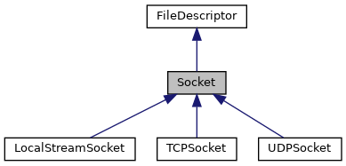

## Overview

[CS144](https://cs144.github.io/) is an introductory course about computer networks. You will learn about the basic principles of computer networks, for example packet switching, layering, encapsulation and protocols; and you will learn how applications such as the world-wide-web, video streaming (e.g. Netflix and Hulu), video conferencing (e.g. Zoom and Skype) and BitTorrent use the network to communicate. You will spend quite a lot of time learning about the specifics of how the Internet works – which is of course by far the biggest computer network ever built. You will learn how applications communicate reliably over an unreliable Internet. And you will build portions of the Internet yourself! In fact, we believe that in CS144 you build more parts of the Internet infrastructure than in any other undergraduate networking class anywhere. It’s really fun to see how the individual pieces work: You build an Internet router, and a reliable data delivery service, and then you use it to communicate with remote servers.

## Resource

[C++ Core Guidelines](http://isocpp.github.io/CppCoreGuidelines/CppCoreGuidelines)

[shootfirst/CS144](https://github.com/shootfirst/CS144)

[【CS144】环境配置，过程记录，与总结 ](https://zhuanlan.zhihu.com/p/553855680)

## Caution

- Use the language documentation at https://en.cppreference.com as a resource.
- Never use **malloc()** or **free()**.
- Never use **new** or **delete**.
- Essentially never use **raw pointers (*)**, and use **“smart” pointers (unique_ptr or shared_ptr)** only when necessary. (You will not need to use these in CS144.)
- Avoid **templates, threads, locks, and virtual functions.** (You will not need to use these in CS144.)
- Avoid C-style strings (char *str) or string functions (strlen(), strcpy()). These are pretty error-prone. Use a **std::string** instead.
- Never use C-style casts (e.g., (FILE *)x). Use a C++ **static_cast** if you have to (you
  generally will not need this in CS144).
- Prefer passing function arguments by **const reference (e.g.: const Address & address).**
- Make every **variable const** unless it needs to be mutated.
- Make every **method const** unless it needs to mutate the object.
- Avoid global variables, and give every variable **the smallest scope** possible.
- Before handing in an assignment, please run **make format** to normalize the coding
  style.

## Notion

### Lab0

